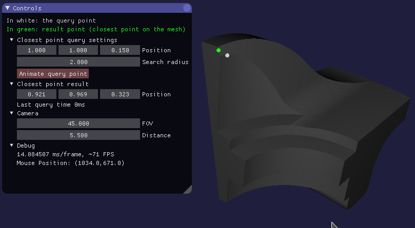

This is an example implementation of the *closest point on mesh* algorithm. Given any 3D point and any mesh, it should find the closest point on the mesh to the given point in a maximum given radius. A GUI comes with it to demonstrate the results and performance. Automated tests are available in the program. They test the low level methods of the algorithm.

:notebook: [Documentation](https://oktomus.com/cpp-closest-point-on-mesh)




# Performance

Tests were made with an AMD Ryzen 5 3600 @ 3.59Ghz. The implemntation only use one core.
In the following tests, all vertices were normalized in the range [-1, 1].

The obj files I have used are available in [common-3d-test-models](https://github.com/alecjacobson/common-3d-test-models).

- Pre-process time: KDTree generation of the mesh point cloud
- Compute time: finding the closest point on the mesh of a given point

| OBJ | Vertex count | Triangles count | Pre-process time | Compute time |
|----|-----|-----|----|----|
|teapot.obj|~19k|~6k|1ms|<1ms
|fandisk.obj|~39k|~13k|2ms|~2ms
|stanford-bunny.obj|~209k|~70k|23ms|~2ms
|armadillo.obj|~300k|~100k|36ms|~5ms
|xyzrgb_dragon.obj|~750k|~250k|77ms|~5ms to ~10ms

# Limitations

- A point far away makes performance works. A simple check distance to bbox will fix this

# Build

This program works only on Linux and require the following dependencies:
- assimp
- glfw

```sh
$ git clone git@github.com:oktomus/cpp-closest-point-on-mesh.git
$ cd cpp-closest-point-on-mesh
$ mkdir build && cd build;
$ cmake -DCMAKE_BUILD_TYPE=Release .. && make -j # Build
$ ./app.gui # Run the GUI
```

# Generate the docs

First, install `doxygen`.

```sh
$ doxygen doxygen
$ firefox docs/html/index.html # Open it
```

# Developer's notes 

## Finding a method

The first thing I did was to find a good method to implement the closes point on mesh algorithm. I already had an idea on how to write a naive implementation.

I found 2 candidates:
- Build a lookup table to speed-up finding time
- Use a set of point on the mesh to simplify the problem

The first, is very common and consists of using some kind of tree like a BVH Tree, Sphere Tree or something else to store the mesh. That way, the step of finding the closest triangles on the mesh is faster. A basic alogirthm using this method would be the following:

1. Before:
  a. Build a lookup table (BVH Tree or something else)
2. When requesting the closest point on the mesh:
  a. Find the closest node in the tree
  b. Find the closest point on the triangles that are in this node.
  c. Go to a. for all other nodes where `distance(query_point, closest_point)` < `distance(query_point, node)`.

The second, is IMHO very clever. Instead of finding the closest triangles and then compute the closest point on all triangles, we generate some points on the triangle first. That way, we just have to find the closest point (instead of the closest triangles). This allow us to use a more efficient lookup table that is designed for finding closest neighbor like a KD-Tree. The problem with this method is that we need to configure the number of points to generate on the mesh. Depending on the density we choose, the results can be poorly computed or to slow to compute. A basic algorithm using this method would be the following:

1. Before:
  a. Generate points on the mesh in the most uniform way possible
  b. Build a lookup table (KD-Tree or something else)
2. When requesting the closest point on the mesh:
  a. Find the closest point in the tree and get the triangle on which the point was generated
  b. Compute the closest point on the triangle 

Because I'm already familiar with the first approach, I decided to implement the second approach.

## Testing

## Going further

- Use SIMD instructions to compute distances and closest point on triangle


# References

- [1](https://github.com/bronzelion/closest-point-on-mesh/wiki/Closest-Point-on-a-Mesh-:-Background-and-Approaches): Closest Point on a Mesh : Background and Approaches
- [2](http://jcgt.org/published/0003/04/05/paper.pdf): Fast Distance Queries for Triangles, Lines, andPoints using SSE Instructions
- [3](https://www.geometrictools.com/Documentation/DistancePoint3Triangle3.pdf): Distance Between Point and Triangle in 3D